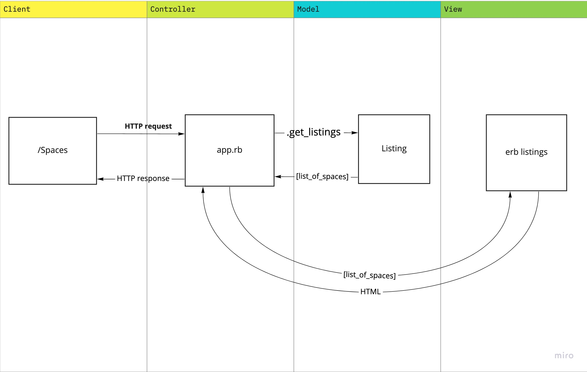

# MakersBnB

## Project Aim
To build a clone of [airbnb.com](https://www.airbnb.com) that allows users to list spaces they have available, and to book spaces for the night.

## Tech/framework used
Front-end:
- HTML, CSS, Bootstrap

Back-end:
- Ruby (programming language)
- PostgreSQL (database)
- RSpec (unit testing)
- Capybara (feature testing)

## User Stories
Below are the user stories to work from for this project:

```
As a signed-in user,
So that customers can see what spaces are available to book,
I can add a new listing

As a signed-in user,
So that customers can make a booking from a selection of listings,
I want to be able to list multiple listings

As a signed-in user,
So that customers know where they're staying,
I want to be able to add to my listing a name, price per night and a short description about the listing

As a signed-in user,
So that I can offer customers flexibility,
I want to filter listings by dates of availability

As a customer,
So that I can stay for a night at my chosen listing,
I can request to make a booking to be approved by the owner of the listing

As a customer,
So that there's no double booking on a listing,
I shouldn't be able to request a booking that's unavailable
```

## Domain Model


## How to use

### Set up the project locally
Clone this repository and install all the gems/dependencies by running:

```
bundle install
```

Set up the databases by connecting to psql:

```
psql
```

Create the `MakersBnB` (development) and `MakersBnB_Test` (testing) databases:

```
CREATE DATABASE "MakersBnB";
CREATE DATABASE "MakersBnB_Test"
```

To create the tables, connect to the database in `psql` and run the SQL scripts in the `db/migrations` folder in the given order.